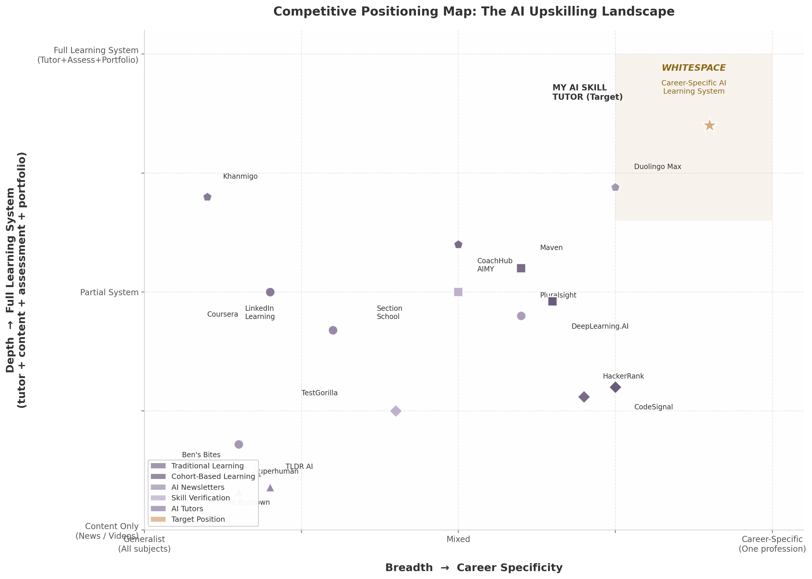

## 1. The Competitive Landscape

The AI upskilling market is not a single battlefield. It is a set of overlapping arenas — each with its own incumbents, economics, and structural blind spots. For myaiskilltutor.com, understanding where these arenas intersect and where they leave gaps is the foundation of every product decision that follows. This chapter maps the terrain: the market's scale and trajectory, the five distinct competitive zones that define it today, and the whitespace those zones collectively reveal.

### 1.1 Market Size and Growth Dynamics

The convergence of AI adoption and workforce anxiety has created a rare market condition: multiple multi-billion-dollar segments growing simultaneously at double-digit rates, all serving the same fundamental need — helping workers stay relevant as AI reshapes their roles. The AI career coaching market alone is valued at $5.48 billion in 2025 and projected to reach $6.69 billion by 2026, growing at 22.3% CAGR [^1^]. This is the narrowest definition of the space. The broader AI-powered personalized learning market, which includes adaptive content delivery, intelligent tutoring, and skills assessment, stands at $9.15 billion in 2025 and is projected to expand to $291.85 billion by 2035 at a 41.5% CAGR [^2^]. These figures describe fundamentally the same user — a working professional who needs to acquire AI skills — but capture different slices of how that need is monetized.

The skills assessment market adds another $5.8 billion in 2025, growing at 12.1% CAGR toward $16.2 billion by 2034 [^3^]. This segment is critical because it represents the employer side of the equation: the willingness of companies to pay to verify that candidates and employees actually possess the skills they claim. Meanwhile, the global newsletter market is projected to reach $17.8 billion by 2028 [^4^], and the top six AI-focused newsletters already generate a combined $20 million annually in advertising revenue [^5^]. This matters because daily AI news consumption is often the first habit in a professional's upskilling journey — a low-friction entry point that platforms can leverage as an acquisition channel.

| Market Segment | 2025 Value | Projected Value | CAGR | Strategic Relevance |
|:---|:---|:---|:---|:---|
| AI Career Coaching | $5.48B [^1^] | $6.69B (2026) | 22.3% | Core TAM for AI-guided career products |
| AI Personalized Learning | $9.15B [^2^] | $291.85B (2035) | 41.5% | Long-term TAM for adaptive learning platforms |
| Skills Assessment | $5.8B [^3^] | $16.2B (2034) | 12.1% | Employer-side monetization layer |
| Newsletter / Daily Briefing | $16.08B [^4^] | $27.08B (2035) | 6.4% | Acquisition engine + ad revenue stream |
| Professional Development (total) | $56.89B [^6^] | $76.25B (2031) | 8.3% | Ceiling spend for B2C learning budgets |

These segments do not operate independently. A professional who reads an AI newsletter daily is more likely to enroll in a course, complete a skills assessment, and eventually seek employer recognition for those skills. The platform that owns the earliest touchpoint — the daily habit — gains asymmetric advantage in capturing value from every subsequent step. The market data thus points to an integrated opportunity: a single platform that combines daily AI briefings, personalized tutoring, skill verification, and portfolio building into one career-specific learning system.

The demand-side data confirms this is not speculative. Sixty-five percent of job seekers now use AI tools during their applications, and candidates who engage with AI-powered career platforms experience 38% higher hire rates compared to those who do not [^7^]. Seventy-seven percent of workers report that AI has increased their workload, while 47% do not know how to achieve the productivity gains their employers expect [^8^]. This gap between AI expectation and AI execution is the market's driving force. Workers are not looking for more content; they are looking for systems that translate AI news into applied career skills, measured outcomes, and employer-recognized proof.

### 1.2 The Five Competitive Zones

The competitive landscape fragments into five distinct zones, each solving a piece of the upskilling puzzle but none delivering the integrated experience the market demands. Understanding the strengths and limitations of each zone reveals why a unified approach represents genuine whitespace rather than incremental improvement.

**Traditional Learning Platforms.** Coursera, Udemy, LinkedIn Learning, and Pluralsight collectively serve over 360 million learners and generate billions in annual revenue [^9^]. Coursera alone added 29 million new learners in 2025, with AI course enrollments accelerating to 15 per minute — nearly double the 2024 rate [^10^]. LinkedIn Learning's AI Coaching feature has improved completion rates by 35% compared to generic learning playlists, and users with AI coaching are 46% more likely to list in-demand skills on their profiles [^11^]. Yet the structural problem persists: the median MOOC completion rate is 12.6%, meaning 87.4% of enrolled learners never finish [^12^]. Self-paced design, passive video consumption, and weak personalization remain endemic. While Coursera's Coach AI assistant maintains a 90% learner satisfaction rating [^13^], and Pluralsight's Iris offers RAG-based in-video Q&A [^14^], none of these platforms solve the core accountability gap. They deliver content exceptionally well; they do not deliver learning systems. Moreover, 88% of generative AI users are non-technical professionals in marketing, operations, sales, and product management [^15^] — yet traditional platforms remain dominated by technical course catalogs with limited relevance to these roles.

**Cohort-Based AI Learning.** Maven, Section School, DeepLearning.AI, General Assembly, and Springboard occupy the premium tier of the market, charging $500 to $5,000 per course and achieving 70-96% completion rates [^16^]. Maven's AI Product Management certification, taught by instructors from OpenAI and Anthropic, costs $2,500 and has garnered over 1,000 reviews at a 4.8 rating [^17^]. Section School's $750 annual subscription bundles 50+ AI courses with its Prof AI teaching assistant [^18^]. The completion rate advantage is real: cohort-based courses with live instruction, peer accountability, and financial commitment demonstrably outperform self-paced alternatives. But the scalability constraints are equally real. Top instructors can only run three to four cohorts per year, each limited to 20-100 students [^19^]. Fixed schedules create time-zone conflicts for global professionals, and the $500-$5,000 price range places these programs out of reach for 40% of prospective learners who report cost as their primary barrier [^20^]. The model produces excellent outcomes for those who can afford it and schedule around it — a self-selected minority.

**AI Newsletters.** The daily AI briefing market is dominated by The Rundown AI (2 million+ subscribers), Superhuman AI (1.5 million+), TLDR AI (920,000+), and The Neuron (500,000+), with combined estimated annual revenue exceeding $20 million from advertising alone [^5^]. Engagement rates are extraordinary: The Rundown reports ~50% open rates, Superhuman ~45%, and TLDR AI 44% — all roughly double the 21.5% industry average [^21^]. Beehiiv platform data shows newsletter open rates hitting 41%+ across its publisher base in 2025, with 28 billion emails sent to 255 million unique readers [^22^]. The business model is proven: free distribution, ad-supported monetization at $20-50 CPM for AI newsletters, with sponsorship spots frequently sold out [^23^]. Yet every major player in this space shares a critical limitation: zero career personalization. The same briefing goes to engineers, marketers, executives, and healthcare workers alike. Readers already self-select newsletters by role — developers subscribe to TLDR AI, product managers to Superhuman, executives to The Rundown [^24^] — but no publication offers genuinely personalized content within a single subscription. This structural homogeneity is not accidental; it reflects the advertising model's incentive to maximize unified audience size for advertiser appeal [^25^].

**Skill Verification Platforms.** HackerRank processes approximately 172,800 technical skill assessment submissions daily, supports 55+ programming languages, and serves 25%+ of Fortune 100 companies [^26^]. TestGorilla offers 400+ tests covering a broader range of roles but locks essential features like ATS integrations behind its $400+ per month Plus tier [^27^]. CodeSignal emphasizes certified, research-backed assessments with a standardized Coding Score, though its removal of public pricing and AWS Marketplace listing at $19,000 annually signals a shift toward enterprise-only positioning [^28^]. These platforms share a common orientation: they are pre-employment screening tools, not ongoing skill-building companions. HackerRank's revenue model is centered on employer-led candidate screening; its practice challenges and free certifications primarily function as lead generation to attract developers who then take employer-sponsored assessments [^26^]. The critical gap is non-technical AI skills. While McKinsey data shows 88% of generative AI users are in non-technical roles [^15^], virtually no platform verifies AI fluency for marketers, sales professionals, operations managers, or HR leaders. LinkedIn's discontinuation of Skill Assessments in 2024 — because "examples of how a candidate applied their skills is increasingly valuable to assess fit" [^29^] — confirms that the old model of multiple-choice testing has failed, but nothing has replaced it for non-technical AI competencies.

**AI Tutors and Coaching Bots.** The evidence for AI tutoring efficacy is now robust across multiple randomized controlled trials. Google's LearnLM outperformed human tutors in a 2025 RCT with 165 UK secondary school students, producing a 5.5 percentage point improvement in solving novel problems (66.2% vs. 60.7%) [^30^]. A 2025 systematic review of 21 empirical studies found performance gains ranging from 15% to 35% with AI tutoring tools [^31^]. Khanmigo grew from 68,000 to 700,000+ users in one school year — a 10x increase [^32^]. Duolingo Max, priced at approximately $30 monthly, has reached ~1.1 million subscribers with 2x longer sessions and 25% higher self-rated confidence after just three AI video call interactions [^33^]. In the professional coaching space, CoachHub's AIMY AI coach achieved 70%+ satisfaction ratings and an 84% continuation rate after users customized their AI coach [^34^]. Yet no product in this category targets working professionals learning career-specific skills. Khanmigo serves K-12 students. Duolingo Max teaches languages. CoachHub AIMY requires enterprise sponsorship and focuses on leadership coaching rather than skill acquisition [^35^]. The professional development market at $56.89 billion [^6^] with an AI coaching segment growing at 13.86% CAGR [^36^] has no AI-native tutor purpose-built for individual working professionals seeking to acquire AI skills relevant to their specific career function.

| Competitive Zone | Representative Players | Scale | Pricing | Core Weakness |
|:---|:---|:---|:---|:---|
| Traditional Learning | Coursera, Udemy, LinkedIn Learning, Pluralsight | 360M+ learners [^9^]; 12.6% median completion [^12^] | $10-$59/month | Passive content; no accountability; weak personalization |
| Cohort-Based Learning | Maven, Section School, DeepLearning.AI, Springboard | $8.4B market [^16^]; 70-96% completion | $500-$5,000/course | Poor scalability; scheduling rigidity; high cost barrier |
| AI Newsletters | The Rundown, Superhuman, TLDR, Ben's Bites | 5M+ combined subs; 40-55% open rates [^21^] | Free (ad-supported) | Zero career personalization; no skill building |
| Skill Verification | HackerRank, TestGorilla, CodeSignal | 172,800 assessments/day [^26^] | $165/mo-$19K/yr | Pre-employment only; no non-technical AI coverage |
| AI Tutors | Khanmigo, Duolingo Max, CoachHub AIMY | 700K+ students; ~1.1M Max subs [^32^][^33^] | $15-$30/month | No product targets working professionals on career skills |

The table above crystallizes the strategic challenge. Each zone excels at one dimension of the upskilling problem — content delivery, accountability, daily engagement, assessment rigor, or personalized instruction — but fails at the others. The median completion rate in traditional learning (12.6%) means content alone does not produce outcomes. Cohort-based programs produce outcomes but at $500-$5,000 price points that exclude most professionals. Newsletters achieve daily engagement at scale but deliver no skill transfer. Assessment platforms verify skills but offer no learning path to acquire them. AI tutors demonstrate learning gains but have not entered the professional career-skills market. The opportunity is not to compete with any single zone on its home turf; it is to integrate the best elements of each into a system that none can replicate independently.

### 1.3 Competitive Positioning Map

The positioning map below plots competitors along two axes: horizontal breadth (from generalist content to career-specific focus) and vertical depth (from passive content delivery to integrated learning systems combining tutoring, assessment, and portfolio verification). The resulting visualization reveals a pronounced clustering pattern and a distinct, unoccupied quadrant.

*Figure 1.1 — 2D competitive positioning matrix: breadth (generalist → career-specific) versus depth (content delivery → full learning system). Bubble shapes indicate category: circles for traditional learning, squares for cohort-based, triangles for newsletters, diamonds for skill verification, pentagons for AI tutors, star for target position. The shaded region marks the identified whitespace.*

The competitive landscape clusters into three distinct regions. The bottom-left quadrant is densely populated by generalist content providers: Udemy, the major AI newsletters (The Rundown, Superhuman, TLDR AI), and to a lesser extent Coursera and LinkedIn Learning. These players compete on audience scale and content breadth but offer minimal personalization, no integrated tutoring, and no skill verification. Their business models are optimized for engagement volume, not learning outcomes — a defensible position for advertising and subscription revenue, but not a position that produces measurable skill acquisition.

The center of the map is occupied by players that have added some depth without sacrificing breadth. Maven and Section School bring accountability through cohort structure. CoachHub AIMY introduces AI-powered coaching but requires employer sponsorship and targets generic leadership skills rather than career-specific AI competencies. Pluralsight and DeepLearning.AI narrow the focus to technical skills but remain fundamentally content-delivery platforms with assessment overlays. None of these center-positioned players solve the full stack: daily engagement + personalized tutoring + verified skill demonstration + career-specific relevance.

The top-right quadrant — career-specific breadth combined with full learning system depth — is entirely unoccupied. This is the whitespace. No competitor currently offers a daily AI briefing personalized by career function, an AI tutor that teaches role-specific AI skills, a portfolio builder that captures applied learning evidence, and a verification layer that employers trust. The individual components exist across different competitors; the integrated system does not. Google's LearnLM demonstrated that AI tutors can outperform human tutors on knowledge transfer [^30^]; Duolingo proved that daily engagement drives subscription revenue at 52.7 million daily active users [^33^]; The Rundown proved that AI newsletters can acquire 2 million subscribers at ~50% open rates [^21^]. The strategic question is not whether each component works in isolation, but whether a single platform can orchestrate them into a career-specific learning system that captures value at every stage of the professional's upskilling journey.

The positioning map also clarifies what myaiskilltutor.com should not attempt. Competing with Coursera on content breadth would require hundreds of millions in content investment. Competing with HackerRank on technical assessment would mean entering a saturated market with entrenched enterprise buyers. Competing with Maven on premium cohort experiences would replicate the scalability constraints that limit that model's reach. The viable path is vertical integration: owning the career-specific layer across the full depth stack — from daily news habit through tutoring to verified portfolio — in a segment where no incumbent currently defends. Eighty-eight percent of generative AI users are non-technical professionals [^15^], yet the entire competitive landscape is optimized for developers, engineers, and technical specialists. The positioning map reveals not just where competitors are, but where they have collectively chosen not to go — and that unoccupied space is where the largest underserved audience waits.
