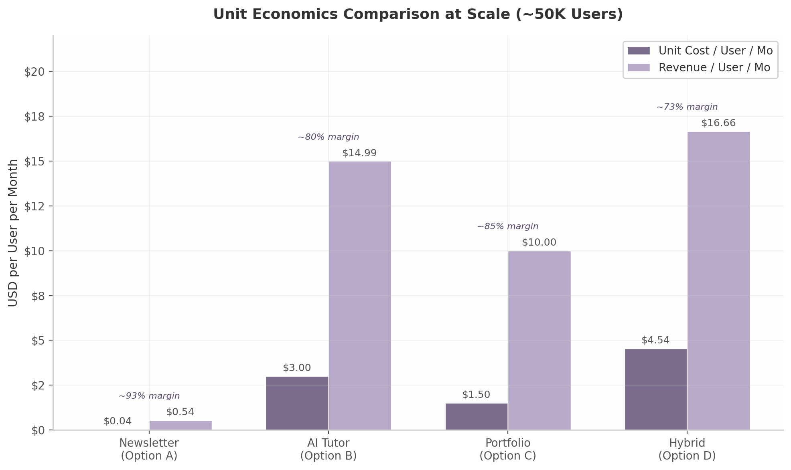

## 2. Product Option Evaluation

The preceding competitive analysis revealed a market crowded at the edges but hollow at the center. No single product combines daily relevance, interactive skill-building, and verified proof of competency for working professionals. This chapter evaluates four distinct product architectures against that gap — each with its own risk profile, capital requirements, and defensibility trajectory. The analysis proceeds by examining each option's definition, strengths, weaknesses, economics, and feasibility, then closes with the strategic tension that must be resolved before any build decision.

---

### 2.1 Option A: Personalized Career Newsletter

#### 2.1.1 Product Definition

A daily or weekday AI briefing curated and generated per career vertical — e.g., "AI for Performance Marketers," "AI for Product Managers," "AI for Operations Leads." Each edition filters the day's AI developments through a role-specific lens: tool recommendations relevant to that function, workflow tutorials using those tools, regulatory updates impacting that sector, and peer benchmarking data. The core promise is relevance — "only the AI news that matters to your job."

The personalization operates at two levels. First, content selection: a RAG pipeline ingests AI industry sources (product launches, research papers, funding news, policy shifts), retrieves items relevant to each subscriber's declared role, and generates a ranked digest. Second, content generation: an LLM rewrites each retrieved item with role-specific framing — the same GPT-5 launch announcement reads differently for a marketer ("new ad creative capabilities") than for a developer ("API changes and rate limits"). This dual-layer approach is technically distinct from the segment-level dynamic content offered by beehiiv or rasa.io, which show or hide pre-written blocks rather than generating unique prose per user [^543^][^564^].

#### 2.1.2 Strengths

**Zero direct competitors.** Despite over 3,000 AI newsletters launching in a two-year period, exhaustive analysis confirms that not a single major publication offers role-based content personalization [^14^]. The Rundown AI (2M+ subscribers), Superhuman AI (1.5M+), TLDR AI (920K–1.25M), The Neuron (500K+), and Ben's Bites (~163K) all deliver identical content to engineers, marketers, and executives alike [^1^][^4^][^7^][^9^][^11^]. Readers self-segment by choosing which newsletters to subscribe to — a TLDR AI for developers, Superhuman for managers — but no publication personalizes within its audience [^15^][^30^]. This structural homogeneity creates a first-mover opportunity for genuine per-user personalization.

**Fastest time-to-market.** A minimum viable product can be operational within 4–6 weeks: a subscriber signup flow capturing role and seniority, a RAG pipeline over 30–50 RSS feeds, GPT-4o-mini for content generation, and Amazon SES for delivery. Open-source implementations of this exact architecture are publicly available and production-tested [^569^][^635^]. The rasa.io platform has proven the same technical pattern at scale — sending 1 million unique emails daily for association clients [^564^].

**Lowest customer acquisition cost.** Newsletters acquire subscribers through content virality, not paid advertising. AI newsletters report extraordinary engagement rates — 40–55% open rates versus the 21.5% industry average — indicating that subscriber word-of-mouth is unusually powerful [^18^][^19^]. The top newsletters grew to seven-figure subscriber counts with minimal paid acquisition: The Rundown added ~10,000 subscribers per day organically through 2025 [^21^]. Lenny Rachitsky, whose newsletter reached 1.2 million subscribers, stated that "paid ads, SEO, biz dev — none of it really did a damn thing. Word of mouth was the biggest lever" [^563^].

**Monetizable from Day 1 via advertising and affiliates.** AI newsletter advertising CPMs range from $20–$50 for consumer newsletters and $50–$150+ for B2B audiences [^576^][^26^]. At 50,000 subscribers with a 45% open rate and $40 CPM, three sponsor placements per week generate approximately $12,000 per month before any subscription revenue [^651^]. AI tool affiliate commissions compound this: Jasper AI pays 25–30% recurring, Copy.ai pays 45% first year, and Surfer SEO pays 25% lifetime recurring [^500^]. A career-specific newsletter recommending role-relevant tools captures both ad impressions and affiliate clicks at the point of highest intent.

#### 2.1.3 Weaknesses

**Low switching cost.** A subscriber can replace the newsletter with a competing product in approximately 60 seconds — the time required to unsubscribe and subscribe elsewhere. Unlike a learning platform where progress data creates retention, a newsletter's value is entirely contained in each day's send. If quality declines or a competitor launches a better product, churn is immediate.

**Thin moat without additional features.** The personalization logic — RAG retrieval + LLM summarization — is replicable by any technically competent team. beehiiv has already launched Dynamic Content capabilities that approach segment-level personalization, and OpenAI or Anthropic could release a newsletter-generation API that commoditizes the entire content layer [^543^]. The only durable defenses are (a) proprietary subscriber data showing which content drives career outcomes, and (b) brand trust built through consistent quality — both requiring years to establish.

**Ad revenue requires scale.** While unit economics are exceptional, meaningful advertising revenue demands 50,000+ engaged subscribers. Below that threshold, sponsorship rates fall to $500–$1,500 per placement, and affiliate commissions are sporadic. A newsletter founder must fund 6–12 months of operation before reaching revenue sustainability — a period during which content quality must remain high without financial feedback.

#### 2.1.4 Economics

The fully-loaded cost to generate and deliver one personalized AI newsletter ranges from $0.001 to $0.012 per email, depending on model choice [^612^][^645^][^665^]. At 50,000 subscribers receiving daily emails, monthly costs total approximately $1,960 — yielding a 93% gross margin at projected blended revenue of $27,000 per month (advertising + subscription) [^589^]. The cost architecture is dominated by LLM inference ($0.0003–$0.001 per email via GPT-4o-mini) and email delivery ($0.10 per 1,000 emails via Amazon SES), with RAG retrieval adding negligible marginal cost at scale [^635^][^665^].

| Cost Component | Per 1,000 Emails | Per 50K Emails / Day / Mo |
|---|---|---|
| LLM generation (GPT-4o-mini) | $1.00–$10.00 | $1,350 |
| Email delivery (Amazon SES) | $0.10–$2.00 | $150 |
| RAG content curation | $0.03–$0.30 | $9 |
| Infrastructure (hosting, DB) | — | $300 |
| **Total** | **$1.13–$12.30** | **$1,959/mo** |
| **Per subscriber per month** | — | **$0.04** |

Revenue at 50,000 subscribers combines advertising (50K subs × 45% open rate × $40 CPM × 12 ad slots/mo ≈ $10,800/mo), subscription (3% conversion at $10/mo = $15,000/mo), and affiliate commissions (estimated $1,500–$3,000/mo), producing total monthly revenue of $27,000–$29,000 against $1,960 in variable costs [^589^][^651^].

#### 2.1.5 Technical Feasibility

The architecture is production-ready today. RAG-based content curation pipelines have been deployed by Süddeutsche Zeitung for news summarization [^571^] and by multiple open-source projects for automated newsletter generation [^569^]. GPT-4o-mini at $0.15 per million input tokens makes per-user generation economically viable at even modest scale [^645^]. Newer models like GPT-4.1 Nano push costs lower still at $0.10 per million input tokens [^646^]. The rasa.io platform has operated this model for 9+ years, demonstrating that 1 million personalized daily emails is not a theoretical capacity but a proven operational reality [^564^]. The primary engineering challenge is not whether it works but whether it works well enough — generating genuinely insightful, role-specific analysis rather than generic summaries that happen to include job keywords.

---

### 2.2 Option B: AI Career Tutor Chatbot

#### 2.2.1 Product Definition

A role-specific conversational AI tutor that answers questions, guides through workflows, provides scaffolded learning exercises, and adapts to each user's skill level and career goals. Unlike general-purpose chatbots (ChatGPT, Claude), the tutor is purpose-built for pedagogy — using Socratic questioning, integrating with curated learning content, and tracking skill progression over time. The product targets working professionals, not students: the learning moments happen during work ("How do I write a better prompt for this analysis?") rather than in dedicated study sessions.

#### 2.2.2 Strengths

**Highest defensibility.** An AI tutor that genuinely improves skills creates switching costs through accumulated learning data — progress histories, mastered concepts, personalized learning paths — that cannot be ported to competing products. This data flywheel compounds over time: more users generate more tutoring interactions, which improve the model's understanding of common failure modes, which improve tutoring quality, which attract more users. Purpose-built educational AI also outperforms general-purpose models: Google's LearnLM, fine-tuned specifically for pedagogy, outperformed GPT-4o by 31% and Claude 3.5 by 11% in pedagogical quality ratings [^342^][^344^].

**Proven learning effectiveness.** The evidence base for AI tutoring is now robust across multiple randomized controlled trials. A 2025 systematic review of 21 empirical studies found performance gains ranging from 15% to 35% with AI tutoring tools [^292^]. Google's landmark RCT with 165 UK secondary school students found that LearnLM tutored students were 5.5 percentage points more likely to solve novel problems than those with human tutors alone, with 93.6% statistical credibility that the AI offered better knowledge transfer [^291^]. Effect sizes in the literature range from 0.23 to 1.3 standard deviations, placing AI tutoring among the most effective educational interventions ever measured [^293^][^294^]. Khan Academy's longitudinal data shows that students increasing practice by 60+ skills saw approximately 30 percentage point gains — a 20–30% increase in learning outcomes [^249^].

**No direct competitor for working professionals.** After extensive research across 20+ searches, no dedicated AI tutoring product purpose-built for working professionals learning career skills was identified [^6^]. The market has strong incumbents in adjacent segments — Khanmigo for K-12 (700K+ students) [^251^], Duolingo Max for language learning (~1.1M subscribers at ~$30/month) [^245^], CoachHub AIMY for enterprise coaching (60+ enterprise clients) [^268^] — but no product serves individual professionals seeking to learn leadership, communication, project management, or data literacy through interactive AI tutoring. This gap exists because professional skills require workplace context that general AI lacks, and because the B2B sales cycle for enterprise professional development is slow and complex [^6^].

#### 2.2.3 Weaknesses

**Hardest to build.** Pedagogical AI requires expertise in learning science, instructional design, and conversational AI that few engineering teams possess. The product must handle open-ended professional questions with no single correct answer, provide feedback on subjective skills like communication strategy, and maintain context across multi-session learning arcs. Google's LearnLM advantage came from dedicated fine-tuning on pedagogical data — a significant R&D investment [^342^]. Even Khanmigo, backed by Khan Academy's content library and OpenAI's models, has shown mixed results in isolating tutor-specific impact [^240^].

**Highest inference costs.** Unlike newsletters where each subscriber receives one pre-generated email, tutoring requires real-time inference per interaction. At $0.01–$0.10 per conversation (depending on model and length), costs scale with engagement — a desirable property in theory but a cash-burn challenge in practice before subscription revenue covers inference. Duolingo's experience is instructive: Max users have 2x longer sessions than standard users, meaning inference costs are concentrated among the most engaged subscribers [^244^].

**Longest path to monetization.** A tutoring product must demonstrate genuine learning gains before users will pay. ChatGPT is already "good enough" for many professional queries, making the upgrade to a paid tutor a hard sell. Duolingo achieved only ~9% Max penetration among its paying base by late 2025, after years of A/B testing and feature development [^245^]. For a new entrant without Duolingo's 52.7 million daily active user base, conversion benchmarks are even more demanding.

#### 2.2.4 Economics

Inference costs for an AI tutor range from $0.01–$0.10 per conversation, depending on model selection (GPT-4o-mini vs. GPT-4o/Claude 3.5 Sonnet), conversation length, and whether retrieval-augmented generation is used. A typical professional user engaging 3–4 times per week generates $0.12–$1.60 in monthly inference cost. Comparable pricing in the market includes Duolingo Max at approximately $29.99/month [^574^], Codecademy Pro at $39.99/month [^584^], and enterprise coaching platforms at $75–$250 per session [^274^]. A $29.99/month price point — aligned with Duolingo Max — would yield gross margins of 80% at the low end of inference cost ($0.12/user/mo) and 73% at the high end ($1.60/user/mo). Break-even occurs at roughly 170–190 paying users assuming $5,000 in monthly fixed costs. The primary economic risk is not unit margin but adoption velocity: at $29.99/month, a new entrant must deliver demonstrably superior tutoring to free alternatives (ChatGPT, Claude) from day one — a product quality threshold that newsletter and portfolio products do not face.

#### 2.2.5 Evidence of Efficacy

The Google LearnLM RCT represents the strongest experimental evidence to date: students tutored by LearnLM achieved 66.2% success on novel problems versus 60.7% for human-tutored students, with supervising tutors approving 76.4% of the AI's messages with zero or minimal edits [^291^]. Duolingo's internal data shows that Max users demonstrate 30% reduction in speaking hesitation after 5 Roleplay sessions and 25% higher self-rated confidence after 3 Video Call interactions [^242^]. Retention improved 20–30% for AI-exposed cohorts, reducing churn [^244^]. These findings suggest that purpose-built AI tutoring not only improves learning outcomes but also drives the engagement metrics that sustain subscription revenue.

---

### 2.3 Option C: Skill Verification & Portfolio Platform

#### 2.3.1 Product Definition

A platform where professionals build, document, and verify AI skills through "build logs" — timestamped records of AI-assisted work including prompts used, tools employed, iterations attempted, and outcomes achieved. These logs form an employer-facing portfolio that demonstrates applied competency rather than course completion. The platform integrates with LinkedIn for distribution and with assessment tools (like Workera or custom evaluations) for third-party validation. The core promise is proof: "show, don't tell" your AI skills.

#### 2.3.2 Strengths

**Most differentiated positioning.** While newsletters and chatbots compete with an ever-expanding set of AI content and conversation tools, verified skill portfolios occupy a nearly empty category. LinkedIn's Featured section and Projects section allow work display, but neither captures AI-specific workflows, prompt engineering demonstrations, or tool proficiency evidence [^335^][^340^]. GitHub serves developers brilliantly but is fundamentally unsuited for non-technical professionals whose AI work happens in ChatGPT, Claude, and Midjourney rather than in code repositories [^279^]. Polywork — the most credible "anti-LinkedIn" attempt — shut down in January 2025 after burning through $41 million, leaving a gap that no successor has filled [^256^].

**Aligns with the "proof of work" hiring trend.** Forty percent of companies have removed degree requirements, and 73% of employers used skills-based hiring practices in 2023 — up from 56% in 2022 [^44^][^45^]. Skills-based hiring is five times more predictive of job performance than education-based screening [^45^]. LinkedIn killed its Skill Assessments program in 2024 because "examples of how a candidate applied their skills" proved more valuable than test scores. A portfolio platform that captures genuine applied work — not certificates — sits directly at the intersection of this structural shift.

**LinkedIn gap creates distribution opening.** LinkedIn remains the default professional identity platform but cannot authentically demonstrate AI skills for non-technical professionals [^281^]. Its skill endorsements are self-reported and easily gamed. Its Featured section accepts static documents but cannot show interactive prompting sessions, AI workflow recordings, or before/after demonstrations. Any platform that integrates with LinkedIn profiles while adding a verification layer below them captures value that LinkedIn itself is structurally unable to provide.

#### 2.3.3 Weaknesses

**Requires distribution first — the chicken-and-egg problem.** A portfolio platform without users is worthless to employers; without employers, users have no incentive to build profiles. Triplebyte — the most funded attempt at a skills-verified hiring marketplace — failed because it could not sustain employer demand at sufficient scale. TalentProof.ai, a newer entrant with pay-per-verified-result pricing at $10 per result, has demonstrated technical feasibility but has not yet achieved marketplace liquidity [^22^]. The general pattern in hiring marketplaces is brutal: Hired was absorbed into Adecco, and Vettery pivoted away from its original model.

**Employer adoption uncertain.** Seventy-four percent of employers prefer verified digital credentials for AI roles, but preference does not translate to purchasing behavior [^31^]. Work-era has achieved traction with enterprise clients (BCG, Eli Lilly, Siemens Energy) but at price points ($40–$540 per user per year) that require enterprise sales cycles and dedicated account management [^17^]. For a startup without Workera's Stanford pedigrees and $44 million in funding, replicating this enterprise motion is unrealistic in the first 18–24 months.

**Triplebyte's failure is cautionary.** Triplebyte raised significant capital, built a respected technical assessment product, and still could not sustain marketplace liquidity. The fundamental problem: even high-quality signal is not valuable without volume. Employers need hundreds of qualified candidates per role, not dozens. Unless a portfolio platform can attract tens of thousands of active users quickly, employer interest will remain theoretical.

#### 2.3.4 Evidence of Market Demand

The structural tailwinds for skill verification are genuine. Eighty-one percent of U.S. employers adopted skills-based hiring practices in 2024 [^45^]. Work samples are the single strongest predictor of on-the-job performance, outperforming interviews, education, and references [^46^]. Eighty-two percent of companies using skills-based hiring report streamlined processes [^45^]. The skills assessment platform market was valued at $5.8 billion in 2025 and is projected to reach $16.2 billion by 2034 [^1^]. Yet the critical caveat is that this market is employer-funded, not employee-funded. A portfolio platform for individuals must either find a way to make employers pay for access (the marketplace model that killed Triplebyte) or convince individual professionals to pay for visibility (a proposition that only works at scale, when employers are already browsing).

---

### 2.4 Option D: Hybrid Platform (Current Direction)

#### 2.4.1 Product Definition

An integrated subscription combining all three components: a personalized newsletter for daily engagement and discovery, an AI tutor for interactive skill-building, and a portfolio builder for verified proof of competency. The current myaiskilltutor.com architecture envisions this as a single $49.99/month subscription, with users flowing from newsletter reading to tutor practice to portfolio documentation in a continuous loop.

#### 2.4.2 Strengths

**Bundle economics.** A subscriber paying $49.99/month for three integrated products generates higher lifetime value than any single-product subscription at comparable scale. The newsletter drives daily engagement (the habit layer), the tutor drives skill improvement (the value layer), and the portfolio drives retention through accumulated work (the lock-in layer). Each component reinforces the others: newsletter content provides tutor conversation starters, tutor sessions produce portfolio entries, and portfolio progress validates the newsletter's relevance.

**Comprehensive value proposition.** For users, the hybrid eliminates the fragmentation of subscribing to separate products — one for news, one for learning, one for credentials. For the business, it creates multiple engagement surfaces that compound retention: a user might churn from a newsletter alone but stays for the tutor; might abandon the tutor but stay for the portfolio. Duolingo's success with a similar multi-feature model (lessons, stories, podcasts, leagues, streaks) demonstrates that multiple engagement vectors reduce single-point-of-failure churn [^469^].

**Natural upsell pathway.** The newsletter serves as a low-friction entry point (potentially free or low-cost), the tutor as a mid-tier upgrade, and the portfolio as a premium feature. This tiered structure mirrors Lenny's Newsletter expansion: free newsletter → paid tier → podcast → community → partner integrations (Product Pass) → conference [^630^]. The newsletter-to-product playbook is well-documented and has generated multiple nine-figure outcomes [^587^][^592^].

#### 2.4.3 Weaknesses

**Highest complexity.** Building one excellent product is hard. Building three simultaneously — each with distinct technical requirements (RAG pipelines, real-time inference, portfolio infrastructure), design paradigms (email, chat, web app), and success metrics (open rate, learning gain, employer engagement) — requires engineering, product, and design resources that a pre-revenue startup rarely possesses. Each component competes for the same finite attention: every day spent improving the newsletter template is a day not spent improving the tutor's pedagogical quality.

**Risk of mediocrity in all three versus excellence in one.** The hybrid faces specialists on every dimension. On newsletters, it competes with The Rundown's speed, Superhuman's simplicity, and TLDR's technical depth — each product has spent years refining its voice and format [^1^][^4^][^7^]. On tutoring, it competes with Duolingo's engagement engineering, Khanmigo's content integration, and Google's model quality [^245^][^251^][^291^]. On portfolios, it competes with LinkedIn's distribution dominance and GitHub's developer mindshare [^281^][^279^]. A bundled product that is "pretty good" at all three and excellent at none will lose users to the best-in-class option in whichever dimension they value most.

**$49.99 pricing above market.** B2C EdTech benchmarks cluster at $19.99–$29.99 per month [^497^]. Duolingo Max — the most comparable AI tutor product with proven market acceptance — is priced at approximately $29.99/month [^574^]. Codecademy Pro, which offers structured skill-building with hands-on practice, is $39.99/month [^584^]. Coursera Plus, with access to 7,000+ courses and professional certificates from Google and IBM, is $399/year ($33/month effective) [^559^]. At $49.99/month, the hybrid product is priced above all major learning platforms except premium cohort-based courses. With EdTech monthly churn averaging 3.8% (37% annual) [^496^], this pricing likely suppresses both conversion and retention.

#### 2.4.4 The Core Tension: Breadth versus Depth

The hybrid's fundamental strategic tension is that it competes with specialists on every dimension while requiring excellence on all three to justify its premium price. A user subscribing primarily for the newsletter will compare it to The Rundown and Superhuman — products with years of editorial refinement and established advertiser relationships. A user subscribing primarily for the tutor will compare it to ChatGPT ($20/month) and Duolingo Max ($29.99/month). A user subscribing primarily for the portfolio will compare it to LinkedIn (free) and Credly-backed certifications. The bundle only wins if all three components are simultaneously excellent — a quality bar that no startup has achieved on its first product iteration.

| Dimension | Option A: Newsletter | Option B: AI Tutor | Option C: Portfolio | Option D: Hybrid |
|---|---|---|---|---|
| **Time to MVP** | 4–6 weeks | 12–16 weeks | 8–12 weeks | 20–28 weeks |
| **Engineering complexity** | Low | High | Medium | Very high |
| **Defensibility** | Low (thin moat) | High (data flywheel) | Medium (network effects) | Medium (bundle lock-in) |
| **Unit cost per user/mo** | ~$0.04 | ~$0.12–$1.60 | ~$1.50 | ~$4.54 |
| **Pricing benchmark** | Free–$10/mo | $29.99/mo | Freemium–$15/mo | $49.99/mo |
| **Gross margin at scale** | ~93% | ~73–95% | ~85% | ~73% |
| **Direct competitors** | Zero | Zero (pros) | Zero (non-tech AI) | Competes with all three |
| **Primary risk** | Low switching cost | High build cost | Chicken-and-egg | Mediocrity in all three |

The table above crystallizes the trade-off. The newsletter offers the fastest path to market with the lowest risk and highest margins, but builds the thinnest moat. The tutor offers the strongest defensibility but demands the most capital and longest development cycle. The portfolio is the most conceptually differentiated but requires distribution that must be built before it. The hybrid captures the upside of all three but concentrates their risks into a single product that must simultaneously succeed across engineering, pedagogy, marketplace dynamics, and pricing psychology — a combination that has defeated better-funded competitors.

| Criterion | Weight | Option A | Option B | Option C | Option D |
|---|---|---|---|---|---|
| Speed to revenue | High | **Excellent** | Moderate | Moderate | Poor |
| Capital efficiency | High | **Excellent** | Moderate | Good | Poor |
| Defensibility potential | High | Poor | **Excellent** | Moderate | Good |
| Market timing | Medium | **Excellent** | Good | Moderate | Moderate |
| Technical feasibility | Medium | **Excellent** | Moderate | Good | Poor |
| Competitive pressure | Medium | **Low** | Low | Moderate | **High** |
| Monetization clarity | Medium | **Clear** | Moderate | Unclear | Moderate |
| Talent requirements | Low | Low | **High** | Moderate | **Very high** |

The weighted assessment reinforces a clear pattern: the newsletter dominates operational and commercial criteria, while the tutor dominates defensibility. The portfolio and hybrid lag across most dimensions, with the hybrid's primary weakness being competitive pressure — it faces specialists on three fronts simultaneously. This scoring framework, combined with the economic analysis, points toward a phased approach rather than an all-at-once build: the newsletter as the acquisition and engagement wedge, followed by tutor integration once daily user habits are established, followed by portfolio features once learning outcomes are demonstrated. The next chapter applies formal scoring weights to these criteria and produces a ranked recommendation.

*Figure 2.1: Unit economics comparison at approximately 50,000 users. The newsletter achieves exceptional margins due to near-zero marginal cost, while the hybrid's higher cost base reflects the combined infrastructure of three product layers. Revenue estimates assume blended monetization (ads + subscriptions for newsletter; pure subscription for tutor; freemium + employer fees for portfolio; blended subscription for hybrid).*
