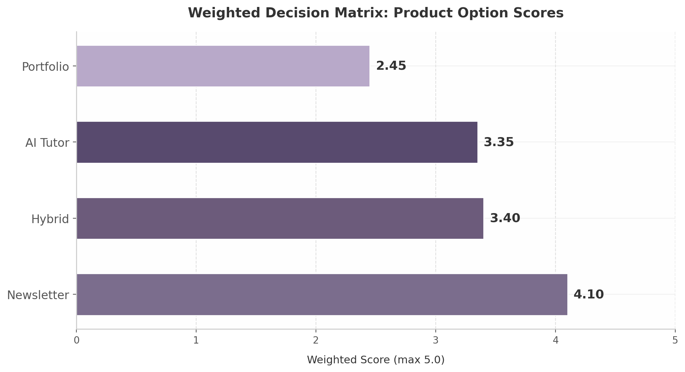

## 3. Decision Matrix & Scoring

The preceding chapters established what the market lacks and what each product architecture could offer. This chapter converts those qualitative assessments into a quantitative framework. A weighted scoring matrix across six criteria — calibrated to the realities of a pre-revenue startup entering a $93 billion competitive arena — produces a ranked recommendation and a phased build roadmap that maximizes learning per dollar spent.

### 3.1 Scoring Framework

Six criteria capture the dimensions that matter most for an early-stage product decision. Each is scored 1–5, with weights reflecting survival priorities for a capital-constrained startup.

**Time to Market (20%).** Speed to a live product generating user feedback is the dominant variable for a pre-revenue startup. Every week without market validation increases burn and decreases the probability of finding product-market fit.

**Defensibility (20%).** Long-term competitive protection — through data network effects, brand trust, and switching costs — determines whether traction can be retained. This matters enormously, but not at the expense of reaching the market.

**Monetization Speed (20%).** The interval between launch and first revenue signals business model viability. For a startup without venture backing, this must be measured in weeks. Products monetizable through advertising or affiliates before reaching scale score highest.

**Strategic Optionality (15%).** The degree to which a first product enables second and third products determines long-term value ceiling. A newsletter that evolves into a tutoring platform offers more optionality than a portfolio product requiring massive scale before any adjacent feature becomes viable.

**Market Size (15%).** All four options operate within multi-billion-dollar segments; differences between a $5 billion and $17 billion TAM matter less at MVP stage than speed and monetization clarity.

**Technical Complexity (10%).** Inverted in scoring: lower engineering risk receives higher marks. The modest weight reflects that technical challenges are solvable with capital, whereas market timing advantages are not.

| Criterion | Weight | Rationale |
|:---|:---|:---|
| Time to Market | 20% | Feedback velocity determines survival for pre-revenue startups |
| Defensibility | 20% | Long-term moat protects gains once traction is achieved |
| Monetization Speed | 20% | Weeks-to-revenue matters more than TAM at MVP stage |
| Strategic Optionality | 15% | First product must enable second and third products |
| Market Size | 15% | All options address multi-billion-dollar segments |
| Technical Complexity | 10% | Engineering risk is solvable; market risk is not |

The weighting prioritizes operational execution over theoretical upside. A startup can recover from a thinner moat or smaller initial market; it rarely recovers from running out of capital before finding product-market fit. The equal 20% weights on Time to Market, Defensibility, and Monetization Speed reflect this survival-first logic.

### 3.2 Option Scoring

| Criterion | Weight | Newsletter | AI Tutor | Portfolio | Hybrid |
|:---|:---|:---|:---|:---|:---|
| Time to Market | 20% | 5 (4–6 weeks) [^569^] | 2 (12–16 weeks) | 3 (8–12 weeks) | 1 (20–28 weeks) |
| Defensibility | 20% | 2 (thin moat; switchable in 60 sec) | 5 (data flywheel) | 3 (network effects at scale) | 4 (bundle lock-in) |
| Market Size | 15% | 4 ($17.8B by 2028) [^4^] | 4 ($9.15B) [^2^] | 3 ($5.8B) [^3^] | 5 (spanning all three) |
| Monetization Speed | 20% | 5 (ads + affiliates from Day 1) [^576^] | 2 (requires proven gains) | 1 (needs employers first) | 3 (newsletter layer early) |
| Technical Complexity | 10% | 5 (RAG + email pipeline) [^564^] | 2 (pedagogical AI) | 3 (portfolio infra) | 1 (three stacks at once) |
| Strategic Optionality | 15% | 4 (upsell to tutor → portfolio) [^630^] | 5 (adds newsletter + portfolio) | 2 (limited without users) | 5 (all integrated) |
| **Weighted Total** | **100%** | **4.10 / 5.0** | **3.35 / 5.0** | **2.45 / 5.0** | **3.40 / 5.0** |

The newsletter-as-wedge scores 4.10 out of 5.0, a decisive margin over the hybrid (3.40) and tutor-first (3.35) approaches. The portfolio-first strategy trails at 2.45, confirming that distribution must precede any marketplace product.

The newsletter's advantage concentrates in the three highest-weighted criteria. Its Time to Market score reflects that production-tested open-source implementations of RAG-based newsletters exist, and rasa.io has proven 1 million unique daily emails at scale [^564^]. Its Monetization Speed derives from AI newsletter CPMs of $20–$50 [^576^] and tool affiliate commissions of 20–45% recurring [^500^], requiring no minimum scale to activate. The Technical Complexity score acknowledges this is the only option a small team can build and operate without ML engineers or pedagogical experts.

The newsletter's critical weakness is defensibility, scored at 2. A subscriber can switch to a competitor in approximately 60 seconds, and the RAG-plus-summarization logic is replicable by any competent team — beehiiv's Dynamic Content already approaches segment-level personalization [^543^]. This thin moat is why the phased roadmap adds tutor and portfolio layers: the newsletter acquires the audience; subsequent layers create the switching costs that retain it.

The AI tutor scores highest on defensibility (5) and strategic optionality (5) but is dragged down by Time to Market (2), Monetization Speed (2), and Technical Complexity (2). The evidence for AI tutoring efficacy is robust — 0.23 to 1.3 standard deviation gains across RCTs [^293^], with Google's LearnLM outperforming human tutors [^291^] — yet building pedagogical AI that demonstrably beats ChatGPT for professional skills demands 12–16 weeks by a team with learning science expertise. Duolingo achieved only ~9% Max penetration after years of testing [^245^], suggesting even best-in-class products face long conversion funnels.

The hybrid scores respectably at 3.40, driven by perfect Market Size (5) and Strategic Optionality (5) scores. But it is critically weakened by Time to Market (1) and Technical Complexity (1): three distinct product stacks with distinct engineering paradigms and success metrics exceed what a pre-revenue startup can deploy. Its $49.99 price point, 67% above Duolingo Max [^574^], further suppresses monetization velocity. The portfolio-first approach at 2.45 suffers the fundamental sequencing problem that killed Triplebyte — a portfolio without users is worthless to employers, and without employers, users have no incentive to build profiles [^256^].

*Figure 3.1 — Weighted scores across four product options. Newsletter-as-wedge (4.10/5.0) outperforms hybrid (3.40), tutor-first (3.35), and portfolio-first (2.45) by a margin driven by advantages in time to market, monetization speed, and technical feasibility.*

### 3.3 Recommended MVP Path

The scoring matrix points to a clear sequence: launch with the newsletter, add the tutor layer to engaged subscribers, and introduce portfolio features only after learning outcomes are demonstrated.

**Phase 1 (Months 1–3): Launch Career-Specific Newsletter.** The MVP is a daily AI briefing personalized by career vertical — starting with 2–3 roles such as "AI for Performance Marketers," "AI for Product Managers," and "AI for Operations Leads." A RAG pipeline over 30–50 curated sources feeds GPT-4o-mini for generation at roughly $0.001 per email [^645^], with Amazon SES handling delivery. The product is operational in 4–6 weeks [^569^], with monetization beginning immediately through sponsor placements at $20–$50 CPM [^576^] and AI tool affiliate recommendations. The Phase 1 milestone is 5,000–10,000 engaged subscribers with open rates above 40%, validating that career-specific personalization drives materially higher engagement than generic briefings. Advertising plus affiliate revenue at this scale is projected at $3,000–$8,000 monthly — enough to cover infrastructure costs and extend runway before any subscription revenue.

**Phase 2 (Months 4–9): Add AI Tutor Layer for Engaged Subscribers.** Once daily newsletter engagement is validated, an AI tutor is introduced as a premium upgrade for the most active subscribers — those consistently opening emails, clicking tool recommendations, and engaging with embedded tutorials. The tutor leverages the newsletter's existing RAG corpus, extending it into interactive Socratic dialogue informed by Google's LearnLM research [^291^]. Integration creates a seamless loop: a subscriber reads about a new AI tool in the morning briefing, practices with the tutor at midday, and receives a follow-up tip the next day based on interaction patterns. Pricing aligns with Duolingo Max at approximately $29.99 per month [^574^], with a reverse trial granting free tutor access to engaged readers. The Phase 2 milestone is 500–1,000 paying tutor users with weekly engagement above 3 sessions and measurable skill progression.

**Phase 3 (Months 10–18): Launch Portfolio and Employer Portal.** With thousands of newsletter subscribers and hundreds of active tutor users generating learning data, conditions for a portfolio feature are finally met. The portfolio captures "build logs" — timestamped records of AI-assisted work including prompts used, tools employed, and outcomes achieved — that subscribers accumulate through newsletter-guided projects and tutor-assisted practice. This aligns with the structural shift toward skills-based hiring: 40% of companies have removed degree requirements and 73% of employers now use skills-based practices [^44^][^45^]. The employer portal opens only after 10,000+ active users with verified skill signals are on the platform, avoiding the chicken-and-egg problem that killed Triplebyte. Employer access is priced as a B2B subscription, creating a second revenue stream monetizing the data flywheel built over 9–12 months.

**The Retention Flywheel.** The phased architecture creates a self-reinforcing engagement loop no single-product competitor can replicate. The daily newsletter establishes habitual content consumption — the same mechanism driving Duolingo's 52.7 million daily actives [^33^] and The Rundown's 2 million subscribers at ~50% open rates [^21^]. Tutor engagement deepens this into active skill practice, with each session generating progress data that increases switching costs. Portfolio documentation converts practice into employer-visible proof, giving subscribers career incentive to maintain activity. Employer interest in verified signals feeds back into motivation: the more employers browse portfolios, the more valuable each subscriber's build log becomes. This flywheel — daily newsletter habit → tutor engagement → portfolio proof → employer interest → subscriber motivation — is the ultimate defensibility. It rests not on any single feature but on compounding learning data that deepens with every interaction.
