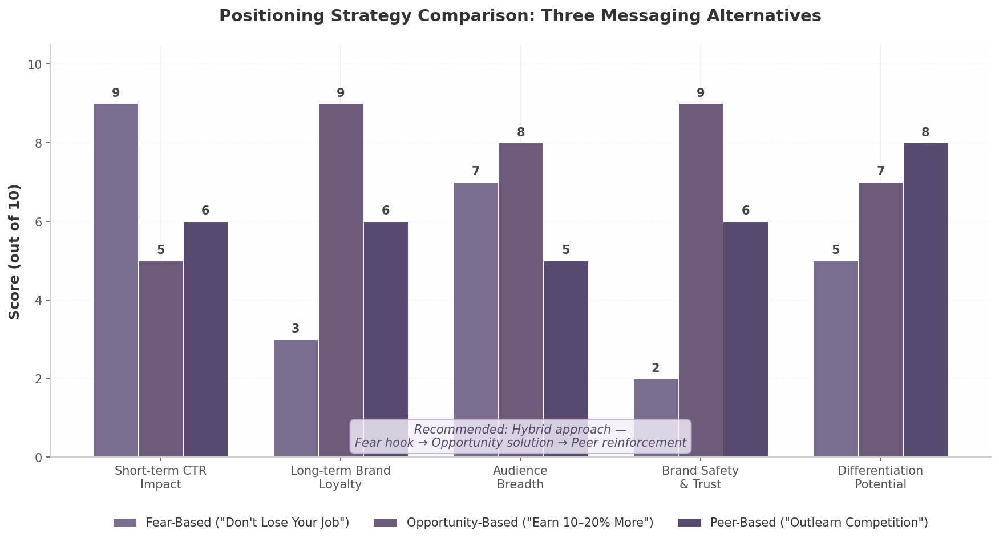

## 5. Brand & Positioning Strategy

A product can have flawless unit economics and a defensible feature set and still stall if its brand fails to occupy a distinct mental slot. For myaiskilltutor.com, the brand challenge is acute: the current name communicates function without differentiation, and the existing positioning around "outlearn your peers" and fear of job loss sits at a strategic fork that demands resolution before a single dollar of paid acquisition is spent. This chapter assesses the current brand, evaluates three positioning alternatives, and maps a naming path that aligns the product with the daily habit it seeks to become.

### 5.1 Current Brand Assessment

#### 5.1.1 Name Analysis: Functional but Generic at Four Syllables

"My AI Skill Tutor" scores highly on one dimension alone: immediate comprehension. A user encountering the name for the first time understands within seconds that the product involves AI, skills, and tutoring. Research on brand naming psychology confirms that "shorter words can be more concrete as a whole, familiar, and image-able" [^609^], and descriptive clarity does lower cognitive load for first-time visitors. In the edtech landscape, clear names are a recognized pattern — MasterClass, Carnegie Learning, Skillshare, and Skillsoft all follow variants of this logic [^529^].

The problem is that clarity without distinction is a commodity position. At four syllables, "My AI Skill Tutor" sits outside the two-syllable sweet spot that dominates top consumer brands — Apple, Google, Walmart, Shell [^609^]. Pathak et al. found that "individuals are faster to respond to shorter names due to the frequency of shorter words in the English language" [^609^], making the current name neurologically slower to process. The "My" prefix adds no strategic value, and the "[Technology] + [Function]" construction reads as a feature description rather than a brand promise. Unlike Duolingo's owl or Superhuman's velocity framing, the name offers no personality hook — leaving the product vulnerable to being perceived as interchangeable with any ChatGPT wrapper.

#### 5.1.2 The "Tutor" Problem: Episodic Connotation in a Daily Habit Market

The word "tutor" implies episodic interaction — a student schedules a session, absorbs material, and returns later. This is the wrong mental model for a product competing for a daily habit slot. Research clarifies: "A tutor transfers knowledge and checks understanding. A coach builds performance through practice and feedback" [^528^]. If the product's core mechanic is daily micro-engagement — a brief lesson, a practice prompt, a skill check — then "coach" or "daily brief" are more accurate descriptors. The Mimic Minds analysis notes that "a lot of products call themselves a coach, tutor, and mentor at the same time," creating confusion [^528^]. A name that commits to one role clearly stands out. Treat the current name as a working title for SEO validation, but plan evolution before product-market fit.

### 5.2 Positioning Alternatives

The product's current messaging oscillates between two emotional registers — fear of job displacement and competitive peer comparison. To resolve this, we evaluate three positioning frameworks against quantitative evidence and project their long-term brand effects.

| Dimension | Fear-Based ("Don't Lose Your Job") | Opportunity-Based ("Earn 10–20% More") | Peer-Based ("Outlearn Your Competition") |
|---|---|---|---|
| **Core Mechanism** | Threat avoidance; urgency through anxiety | Aspirational gain; growth mindset activation | Social comparison; competitive pride |
| **CTR Performance** | +70% vs. positive headlines [^595^] | Baseline | +15–20% estimated |
| **Long-term Loyalty** | Low — anxiety decays, brand fatigue high | High — aligns with self-improvement identity | Medium — effective for ambitious segments only |
| **Brand Association Risk** | High — consumers associate fear feelings with brand [^599^] | Low — positive affect transfer | Medium — competitive framing alienates collaborative learners |
| **Best Funnel Stage** | Awareness (hook) | Consideration → Conversion → Retention | Conversion reinforcement |
| **Audience Breadth** | Broad — 55% believe AI will eliminate more jobs than it creates [^563^] | Broad — 52% of young adults worry about career impact [^573^] | Narrow — appeals primarily to competitive professionals (tech, finance, consulting) |
| **Key Data Point** | Only 2% of ads are negative, creating standout potential [^599^] | AI-skilled workers earn 10–20% above counterparts [^566^] | High-loyalty firms grow revenue 2.5× faster than peers [^532^] |
| **Recommended Usage** | Sparingly — opening hook only | Primary messaging architecture | Social proof layer for competitive segments |

The pattern is clear: no single framework dominates. Fear delivers superior short-term click-through — 70% higher CTR and 18.8% higher conversion in controlled experiments [^595^] — but "if your messaging is causing consumers to feel anxious and afraid, there's a good chance they're going to associate those feelings with your brand" [^599^]. With only 2% of ads employing negative framing, fear cuts through clutter but leaves a residue.

#### 5.2.1 Fear-Based Positioning: High CTR, High Risk

The fear narrative is factually grounded: 55% of people believe AI will eliminate more jobs than it creates, and 52% of young adults aged 18–24 worry about negative career impact [^563^]. Females and the 18–29 cohort report significantly higher fear than other demographics [^573^], creating a large addressable audience motivated by threat avoidance. The danger is brand dilution over time — a product positioned as "the thing that reminds you AI might take your job" becomes emotionally taxing to engage with daily. Users churn not because the product fails but because the brand experience itself is unpleasant. Deploy fear as an entry hook, never as a retention architecture.

#### 5.2.2 Opportunity-Based Positioning: The Long-Term Play

Opportunity-based messaging reframes AI skills as a career accelerator. PwC research found that even highly automatable roles saw 38% job growth between 2019 and 2024 [^610^], and AI-skilled workers typically earn 10–20% more than counterparts in traditional roles [^566^]. This framework builds long-term brand affinity by aligning with the user's aspirational self-image — the same mechanism that makes fitness and wellness brands sticky. Research confirms that "a balanced approach is often the best strategy" — leading with hope and following with empowerment outperforms sustained fear [^537^].

#### 5.2.3 Peer-Based Positioning: Segmented Effectiveness

The "outlearn your competition" framing targets ambitious professionals in technology, finance, and consulting — industries where relative skill advantage translates directly to career outcomes. Businesses with high brand loyalty grow revenue 2.5 times faster than peers [^532^]. However, competitive framing risks alienating users who prefer collaborative environments. Treat peer-based messaging as a reinforcement layer for competitive segments, not as the primary architecture.

**Recommended hybrid:** Lead with opportunity, use fear sparingly for urgency hooks, and reinforce with peer social proof. This maps each framework to its highest-return funnel stage.

### 5.3 Naming Considerations

#### 5.3.1 Direction: Shorter, Active, Habit-Oriented Names

The naming objective is to signal daily utility rather than episodic education. The product competes for a morning routine slot — the same slot Morning Brew occupies with "become smarter in just 5 minutes" [^593^] and Superhuman owns with "get smarter about AI in 3 minutes a day" [^640^]. The name should feel like a daily ritual, not a semester commitment.

Research on 300+ edtech companies reveals five dominant naming patterns: short and catchy (Udemy, Guild — two syllables max); clear and descriptive (MasterClass, Coursera); dictionary words (Skillshare, Degreed); personal names (Mimo, Sana); and suffix trends —ly, -able, -ify (Amplify, Teachable, Brainly) [^529^]. The strongest path combines short, action-oriented dictionary words or compounds that communicate ongoing competitive advantage. Four directions merit exploration: **action-oriented compounds** (SkillStack, UpSkillr) that risk sounding like tools; **aspirational single words** (Edge, Alto) that require marketing investment; **brand name + tagline** ("ALMA: Your Daily AI Career Coach") following the Duolingo model; and **time-based promise names** ("The AI Brief," "5-Minute AI") leveraging the proven newsletter positioning that Morning Brew ($70M revenue) [^593^] and Superhuman (1M+ subscribers) [^640^] validated. One critical finding: "Outlearn" was previously used by a developer learning platform funded by General Catalyst Partners [^569^], creating trademark and SEO risk.

#### 5.3.2 Patterns from Successful Brands

Three case studies offer directly applicable lessons. **Duolingo** (59 million monthly active users) [^485^] demonstrates that brand personality can be the primary differentiator — CEO Luis von Ahn estimated that roughly 15% of new users arrive because of "some sort of owl thing" [^572^]. A mascot creates emotional connection that no feature set can replicate. **Section** (formerly Section4) provides the most relevant rebrand blueprint. After growing to 20,000 students, the company dropped the "4" because the original meaning had become a liability [^513^], evaluating against three hurdles — Relevance, Differentiation, Sustainability — and scoring their old brand B+ on relevance but D on differentiation [^515^]. For myaiskilltutor.com, the equivalent scores would likely be Relevance A-, Differentiation D, Sustainability C. **Morning Brew** proves that a daily brief format scales to $70 million in revenue with 4.4 million subscribers and 50%+ open rates [^593^]. The brand name encodes the promise: a daily ritual (morning) that is actionable (brew). Any new name should achieve the same semantic compression.

#### 5.3.3 Domain Strategy: Secure Both .com and .ai; Avoid Add-On Words

The domain extension decision carries both consumer trust and investor credibility implications. Seventy percent of U.S. consumers implicitly trust .com domains, while .ai's trust rating reaches only 34% even among its strongest demographic (ages 35–54) [^625^]. Critically, 98% of investors say lacking a .com affects pitch credibility [^625^]. At the same time, .ai registrations grew from 50,000 in 2018 to over 600,000 by early 2025, with a record $700,000 sale for you.ai [^633^] — signaling that .ai has established legitimacy for AI-native brands.

The recommended strategy: secure both extensions, using .ai as the primary product domain (signals innovation, better availability) while holding .com defensively. A critical constraint: research shows "an AI company's credibility was harmed for 96% of customers when an add-on word (other than AI) was used in the domain name" [^630^]. If the ideal .com is unavailable, a distinctive brand with clean .ai presence outperforms a compromised .com with add-on words. Viable patterns include [Word].ai (edge.ai, brief.ai), [Verb]+[Word].com, and [Compound].ai (skillstack.ai). Secure domains in parallel with name selection — not as an afterthought.
