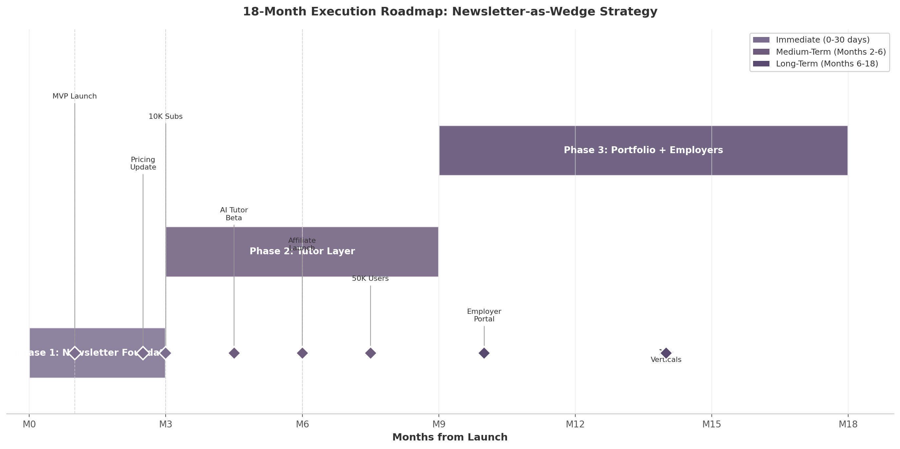

## 6. Strategic Recommendations & Next Steps

The preceding analysis converged on a single verdict: newsletter-as-wedge outperforms all alternative configurations at 4.1 out of 5 on the weighted decision matrix, driven by its unmatched combination of low capital requirements, rapid feedback loops, and a compounding data flywheel [^22^]. The $93 billion combined TAM across AI career coaching, personalized learning, skills assessment, and newsletter advertising creates sufficient headroom for phased expansion from a single vertical into a multi-sided platform [^1^][^2^][^3^]. The 18-month execution roadmap below translates this strategic choice into discrete actions with milestones, resource priorities, and risk mitigations.

### 6.1 Immediate Actions (Next 30 Days)

#### 6.1.1 Pivot to Newsletter-as-Wedge: Define 2–3 Initial Career Verticals

The first 30 days should narrow the audience to the most underserved segment. Eighty-eight percent of generative AI users are non-technical — spanning marketing, product management, operations, sales, and HR — yet virtually every skills platform targets developers [^10^]. This mismatch is the wedge. The team should select two to three verticals based on audience accessibility through existing communities, visible AI tool adoption curves, and affiliate commission density. Performance marketing, product management, and operations are the strongest initial candidates: each has a well-defined tool stack, active practitioner communities, and 20–45% recurring affiliate commissions [^12^]. The newsletter should be positioned around daily utility rather than education — habit-forming products consistently outperform episodic "tutors" on retention metrics [^6^].

#### 6.1.2 Reduce Pricing to $29.99/mo; Introduce $19.99/mo Newsletter-Only Tier

The current $49.99 monthly price sits above every major B2C learning platform except premium cohort courses. Duolingo Max, the most comparable AI-native tutor, commands $29.99 per month; Codecademy Pro is $39.99; Coursera Plus breaks down to roughly $33 monthly [^8^][^9^]. At $49.99, the product faces a conversion headwind before users experience value. The recommended restructuring introduces a $19.99 tier for the newsletter alone, $29.99 for the full platform with AI tutor access, and a $299 annual plan with a 17% effective discount. Given the 3.8% median monthly churn rate in EdTech, every pricing optimization that extends subscriber lifetime has outsized impact on lifetime value [^11^].

#### 6.1.3 Build Minimal Personalized Newsletter MVP Using RAG + LLM Pipeline

The MVP should center on a RAG + LLM pipeline that ingests daily AI news, research, and product launches, then restructures content into career-specific briefings. Per-email generation costs range from $0.001 to $0.01, enabling net margins of approximately 93% at 50,000 subscribers [^7^]. The rasa.io platform demonstrates that one million uniquely personalized emails can be delivered daily for under $500 [^20^]. The engineering priority is consistency — a daily email that arrives at the same time, with the same structure, tailored to the recipient's vertical and skill interests. The product must collect telemetry from day one: which links were clicked, which tools were favorited, which topics prompted unsubscribes. This data becomes the foundation of the personalization engine and, ultimately, the flywheel.

### 6.2 Medium-Term Priorities (Months 2–6)

#### 6.2.1 Achieve 10,000 Engaged Newsletter Subscribers

The 10,000-subscriber threshold is the first non-negotiable validation milestone. At this scale, the business generates sufficient signal to distinguish high-engagement verticals from low-potential ones, and sufficient revenue to fund Phase 2. AI-focused newsletters achieve 40–55% open rates against a 21.5% industry average, indicating genuinely attentive subscribers in this niche [^6^]. Growth should come from three channels: organic sharing (optimize for forward-to-a-colleague behavior), LinkedIn distribution (short-form excerpts), and targeted outreach to AI tool communities. The free-to-paid conversion target should be calibrated to 3–5% initially, rising to 8–10% as the AI tutor layer demonstrates value.

#### 6.2.2 Integrate AI Tutor for Top 2 Career Verticals Based on Engagement Data

Once engagement data identifies the top two verticals, the AI tutor should be introduced as a reverse trial: newsletter subscribers receive limited tutor interactions before a paywall requires the $29.99 tier. Randomized controlled trials confirm AI tutoring achieves effect sizes of 0.23 to 1.3 standard deviations, with Google's LearnLM outperforming human tutors in published studies [^19^]. Critically, no dedicated AI tutor exists for working professionals — Khanmigo targets students; CoachHub AIMY serves enterprise contracts [^19^]. The tutor should preserve the daily newsletter habit while adding on-demand support for skill gaps surfaced by behavior: if a subscriber consistently clicks articles about prompt engineering, the tutor should proactively offer a guided practice session.

#### 6.2.3 Launch Affiliate Partnerships with 10–15 High-Value AI Tools

At 50,000 subscribers, conservative estimates place monthly advertising and affiliate revenue between $8,000 and $27,000 — potentially exceeding subscription revenue in early stages [^25^]. AI newsletters command CPMs of $20 to $50, and tool affiliate programs pay 20–45% recurring commissions [^12^][^13^]. The first partnerships should target high-relevance tools in each vertical: content creation suites for marketers, workflow automation for operations, analytics platforms for product managers. Every recommendation should be tracked at the user level, both to measure affiliate attribution and to enrich personalization profiles.

### 6.3 Long-Term Vision (Months 6–18)

#### 6.3.1 Build the Data Flywheel: Usage Data Improves Personalization

At month six, the architecture shifts from linear to compounding. Every interaction — email opens, tutor dialogues, tool clicks, lesson completions — refines the personalization model, which increases engagement, attracts more users, and generates more data. While AI-generated content is commoditized, per-user learning graphs showing skill progression over time cannot be replicated without a comparable user base [^10^]. The engineering investment in analytics during months one through three pays its full return here: the quality of the flywheel is determined by the granularity of the data collected at the outset.

#### 6.3.2 Launch Employer-Facing Skill Verification at 50,000+ Active Users

The employer portal is a Phase 3 feature because the talent marketplace model has a brutal chicken-and-egg problem — Triplebyte failed at it; Hired was absorbed into Adecco [^21^]. Without verified learners, employers will not pay; without employer demand, learners will not build profiles. However, once the platform reaches 50,000 active users with verified skill progression, the employer portal becomes a natural B2B layer. LinkedIn's trajectory validates this sequencing: build the audience first, monetize employers second [^17^]. Forty percent of companies have removed degree requirements, and 74% of employers prefer verified digital credentials for AI roles [^16^][^18^]. The verification product should emphasize "proof of work" — documented workflows and outcome logs — rather than certificates, because applied evidence outweighs test completion in hiring decisions.

#### 6.3.3 Expand to 10+ Career Verticals with Vertical-Specific AI Tutor Personalities

By month 14, the platform should support ten or more verticals, each with a distinct AI tutor personality calibrated to the profession's communication norms. Expansion should follow engagement density: new verticals are added only when subscriber data from adjacent roles signals demand. Cohort-based communities — achieving 70–96% completion versus 12.6% for self-paced courses — should be layered as lightweight accountability structures [^14^]. Skool's AI category, with over 800,000 members across 170,000 communities, demonstrates practitioners will self-organize when given infrastructure [^24^]. Community moderation costs scale non-linearly at $3,000–$10,000 per month beyond 5,000 members, so AI-assisted moderation should be built into the architecture from launch.

### 6.4 Risk Factors

| Risk Category | Risk Description | Probability | Impact | Mitigation Strategy |
|:---|:---|:---|:---|:---|
| Competitive | Major newsletters add basic career filtering | Medium | High | Deep personalization via usage data; content curation moat [^5^] |
| Technical | LLM API costs rise sharply | Medium | Medium | Hybrid architecture with local models; 93% margin buffer [^7^] |
| Market | AI tools become zero-learning-required | Low | High | Pivot toward workflow integration and outcome documentation |
| Execution | 10K subscriber milestone not reached | Medium | High | Narrower vertical focus; increased paid acquisition |
| Retention | Monthly churn exceeds 3.8% benchmark | Medium | Medium | Daily streak mechanics; community accountability [^11^][^15^] |
| Regulatory | AI tutor claims attract compliance scrutiny | Low | Medium | Avoid outcome guarantees; frame as guidance, not certification |

The competitive risk warrants particular attention. The major AI newsletters — The Rundown, Superhuman, TLDR — collectively reach over 5 million subscribers and have demonstrated willingness to evolve formats [^4^]. If any adds basic career-vertical filtering, first-mover advantage in personalization depth becomes the primary defense. This underscores the urgency of building the data flywheel early: a competitor can replicate content, but cannot replicate six months of individualized learning behavior without first acquiring a comparable user base. The LLM cost risk is manageable — even a 5x increase in per-email generation cost would leave gross margins above 60% [^7^]. The most consequential market risk is a structural shift in which AI tools become so intuitive that professionals no longer need guided learning. This remains low probability: 77% of workers report AI has increased their workload, and 47% do not know how to achieve productivity gains from available tools [^4^]. Demand for structured skill development is durable, though its specific form will evolve.

*Figure 6.1: Phased execution roadmap showing the three-phase transition from newsletter foundation through tutor integration to employer-facing skill verification.*

| Phase | Timeline | Primary Objective | Key Deliverables | Validation Gate |
|:---|:---|:---|:---|:---|
| Phase 1: Newsletter Foundation | Months 0–3 | Launch and validate career-specific daily newsletter | 2–3 verticals live; RAG pipeline operational; tiered pricing active | 10,000 engaged subscribers [^6^] |
| Phase 2: Tutor Layer | Months 3–9 | Integrate AI tutor and monetization layers | Tutor for top 2 verticals; 10–15 affiliate partnerships; community beta | 50,000 active users; 8–10% paid conversion |
| Phase 3: Portfolio + Employers | Months 9–18 | Launch skill verification and employer portal | Employer-facing profiles; 10+ verticals; B2B revenue stream | 50,000+ users with skill progression data [^18^] |

*Table 6.1: Summary roadmap with validation gates. Phase transitions are contingent on hitting engagement milestones, not calendar dates.*

The power of this roadmap lies in its optionality. Phase 1 requires minimal engineering — a RAG pipeline, email delivery, and a landing page — yet generates the data and revenue to fund Phase 2. If the 10,000-subscriber gate is not reached by month three, vertical focus can be narrowed without a major capital write-off. If reached ahead of schedule, the tutor layer can accelerate. Each phase builds a compounding asset: subscribers become data, data becomes personalization, personalization becomes engagement, engagement becomes employer demand, and employer demand closes the retention flywheel by giving subscribers a tangible career incentive to maintain their streak. The newsletter is not the final product — it is the wedge that opens a market no competitor currently occupies.
